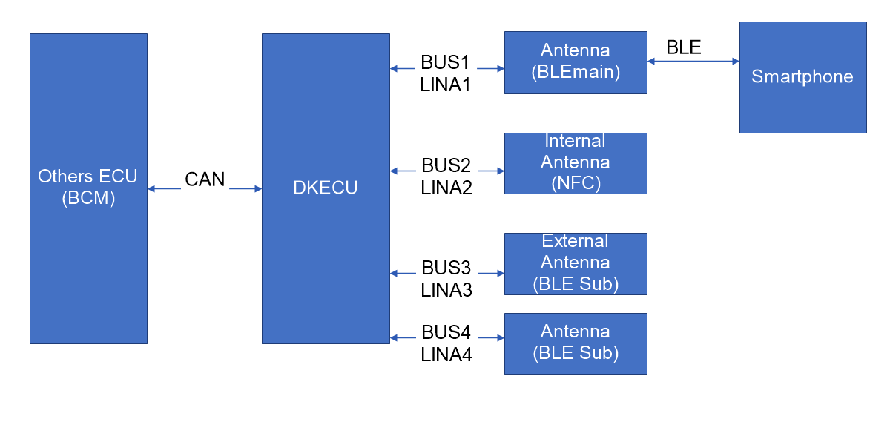
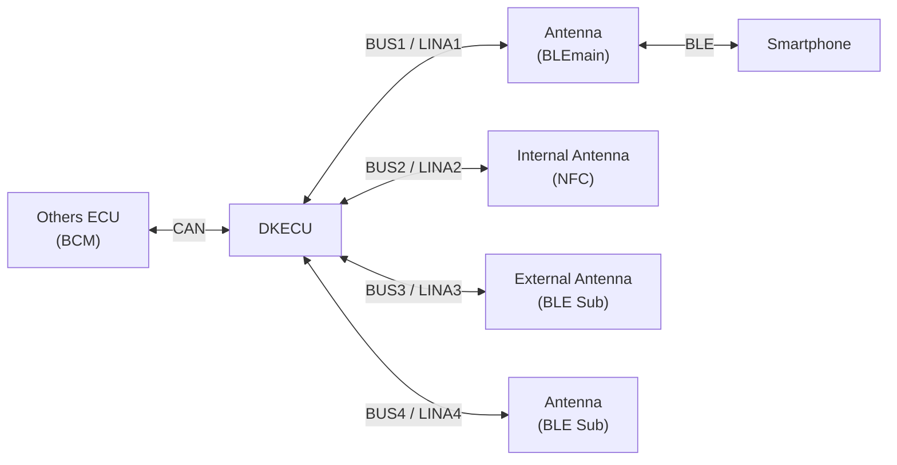

# DKECU Architecture

## Pham vi phat trien

Du an nay chi phat trien **DKECU** cho he thong khoa thong minh cua xe.

Nhung thanh phan ben ngoai DKECU nhu **Others ECU (BCM)**, **Antenna (BLEmain)**, **Internal Antenna**, **External Antenna**, **Sub Antenna** va **Smartphone** duoc xem la he thong ngoai vi. DKECU chi quan tam den tin hieu/giao tiep voi cac thanh phan do thong qua CAN va LIN.

## So do he thong

## Vai tro cua DKECU

DKECU la ECU trung tam cua chuc nang Digital Key. DKECU nhan trang thai xe tu Others ECU (BCM) qua CAN, nhan thong tin tu cac Antenna qua LIN, sau do xu ly logic cho phep mo khoa cua, cho phep khoi dong dong co, va danh gia vi tri/thong tin RSSI cua the/dien thoai.

DKECU khong truc tiep giao tiep BLE voi Smartphone. Giao tiep BLE duoc thuc hien boi Antenna (BLEmain). DKECU chi xu ly du lieu phan hoi tu Antenna qua LIN.

## Giao tiep voi Others ECU (BCM)

Others ECU (BCM) cung cap cac tin hieu trang thai xe cho DKECU thong qua CAN, bao gom:

- Trang thai cua xe.
- Trang thai dong co.
- Tin hieu IG.
- Tin hieu ACC.
- Cac tin hieu body/control lien quan den dieu kien mo khoa va khoi dong.

DKECU su dung cac tin hieu nay de quyet dinh dieu kien hop le cho chuc nang Digital Key. Vi du: chi cho phep khoi dong khi trang thai xe, IG/ACC va dieu kien xac thuc hop le.

## Giao tiep voi Antenna qua LIN

DKECU giao tiep voi cac Antenna thong qua cac bus LIN rieng:

| Bus | Thiet bi | Vai tro |
| --- | --- | --- |
| BUS1 / LINA1 | Antenna (BLEmain) | Thu thap RSSI qua BLE va phan hoi thong tin BLE/Smartphone cho DKECU |
| BUS2 / LINA2 | Internal Antenna (NFC) | Xac thuc cham trong xe, cho phep mo dong co khi the da dang ky hop le |
| BUS3 / LINA3 | External Antenna (BLE Sub) | Xac thuc cham tai vi tri cua lai, cho phep mo cua khi the da dang ky hop le |
| BUS4 / LINA4 | Antenna (BLE Sub) | Ho tro thu thap RSSI de danh gia vi tri |

## Chuc nang cua cac Antenna

**Antenna (BLEmain)** thu thap RSSI thong qua BLE va giao tiep BLE voi Smartphone. DKECU chi quan tam den phan hoi LIN tu Antenna nay, khong xu ly BLE stack truc tiep.

**External Antenna** nam tai vi tri cua dong/mo cua nguoi lai. Khi nguoi dung cham vao va the/digital key da duoc dang ky hop le, DKECU co the cho phep mo cua dua tren thong tin Antenna gui ve.

**Internal Antenna** nam trong xe, duoi man hinh. Khi nguoi dung cham vao va the da dang ky hop le, DKECU co the cho phep mo dong co de xe chay. Truong hop dong co ON tu dien thoai cung duoc xem xet o muc phan hoi LIN tu Antenna (BLEmain).

**Sub Antenna** phuc vu thu thap RSSI, ho tro DKECU danh gia vi tri/tinh hop le cua digital key.

## Luong xu ly tong quat

1. DKECU nhan trang thai xe tu Others ECU (BCM) qua CAN.
2. DKECU polling/nhan phan hoi tu cac Antenna qua LIN.
3. Antenna (BLEmain) thu thap RSSI/BLE va gui thong tin lien quan ve DKECU qua LIN.
4. External Antenna bao ve luong mo cua tai vi tri cua lai.
5. Internal Antenna bao ve luong cho phep khoi dong trong xe.
6. DKECU ket hop trang thai xe, du lieu Antenna, trang thai dang ky key va dieu kien an toan de quyet dinh hanh dong.

## Ranh gioi trach nhiem

| Thanh phan | Co phat trien trong du an? | Trach nhiem trong kien truc |
| --- | --- | --- |
| DKECU | Co | Xu ly logic Digital Key, CAN voi BCM, LIN voi Antenna, quyet dinh mo khoa/khoi dong |
| Others ECU (BCM) | Khong | Cung cap tin hieu trang thai xe qua CAN |
| Antenna (BLEmain) | Khong | Giao tiep BLE voi Smartphone, thu thap RSSI, phan hoi qua LIN |
| External Antenna | Khong | Phat hien thao tac cham mo cua va phan hoi qua LIN |
| Internal Antenna | Khong | Phat hien thao tac cham trong xe de cho phep khoi dong |
| Sub Antenna | Khong | Thu thap RSSI ho tro danh gia vi tri |
| Smartphone | Khong | Thiet bi nguoi dung giao tiep BLE voi Antenna (BLEmain) |

## Gia dinh thiet ke

- DKECU la LIN master cho cac duong LINA1, LINA2, LINA3 va LINA4.
- Cac Antenna la LIN slave va phan hoi du lieu khi DKECU yeu cau.
- DKECU khong thuc hien BLE stack truc tiep.
- Logic xac thuc key, dieu kien mo khoa va dieu kien cho phep khoi dong nam trong DKECU.
- Others ECU (BCM) duoc xem la nguon tin hieu trang thai xe, khong nam trong pham vi phat trien.
